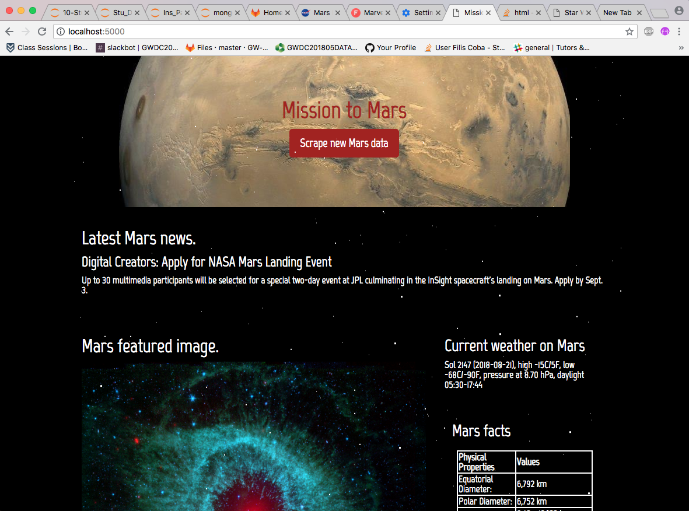

# Welcome to Martian Web-Scraping!
This assignment involved creating an app which scraped data from NASA sites, obtaining information on the planet Mars. The site updates information and a featured image, in real time daily! 

To view the site you must first:
1. Run <code>mongod</code> in your terminal which starts MongoDB server to store all the NASA data you will scrape. 
2. Start the flask app. Type <code>source activate PythonData</code> in your terminal, then typing <code>python app.py</code> to run your app.py code which run the flask app. 
3. You should see a site which looks like the image below! 

